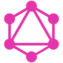

<div align="center">

```text
zaid@github:~$ whoami
```

# **`Z A I D`**
#### **Full Stack Developer · Software Engineer · Builder**

<p>
  <code>[ FRONTEND ]</code> &nbsp;
  <code>[ BACKEND ]</code> &nbsp;
  <code>[ DATABASES ]</code> &nbsp;
  <code>[ CLOUD ]</code> &nbsp;
  <code>[ AUTOMATION ]</code>
</p>

<p>
  <a href="https://github.com/Zaid7829"><strong>GitHub</strong></a> &nbsp;·&nbsp;
  <a href="mailto:mdyusuffaiz517@gmail.com"><strong>Email</strong></a> &nbsp;·&nbsp;
  <a href="https://github.com/Zaid7829?tab=repositories"><strong>Repositories</strong></a>
</p>

<!-- DIGITAL PARTICLE AVATAR -->


</div>

<br>

---

### `~/ 01. whoami`

<div align="center">
  
</div>

<br>

> *"Don't just make it work. Make it understandable, maintainable, and useful."*

<br>

---

### `~/ 03. toolbox`

<div align="center">
  
</div>

<br>

<!-- VISUAL TECHNOLOGY INDEX -->
<table>
  <tr>
    <td width="20%" valign="middle"><code>LANGUAGES</code></td>
    <td>
      <a href="https://www.typescriptlang.org" title="TypeScript · Languages"></a> &nbsp;
      <a href="https://developer.mozilla.org/en-US/docs/Web/JavaScript" title="JavaScript · Languages"></a> &nbsp;
      <a href="https://www.python.org" title="Python · Languages"></a> &nbsp;
      <a href="https://go.dev" title="Go · Languages"></a> &nbsp;
      <a href="https://www.rust-lang.org" title="Rust · Languages"></a> &nbsp;
      <a href="https://www.java.com" title="Java · Languages"></a> &nbsp;
      <a href="https://isocpp.org" title="C++ · Languages"></a> &nbsp;
      <a href="https://en.wikipedia.org/wiki/SQL" title="SQL · Languages"></a> &nbsp;
      <a href="https://www.gnu.org/software/bash" title="Bash · Languages"></a>
    </td>
  </tr>
  <tr>
    <td width="20%" valign="middle"><code>FRONTEND</code></td>
    <td>
      <a href="https://react.dev" title="React · Frontend"></a> &nbsp;
      <a href="https://nextjs.org" title="Next.js · Frontend"></a> &nbsp;
      <a href="https://tailwindcss.com" title="Tailwind CSS · Frontend"></a> &nbsp;
      <a href="https://vuejs.org" title="Vue · Frontend"></a> &nbsp;
      <a href="https://angular.dev" title="Angular · Frontend"></a> &nbsp;
      <a href="https://svelte.dev" title="Svelte · Frontend"></a> &nbsp;
      <a href="https://vite.dev" title="Vite · Frontend"></a> &nbsp;
      <a href="https://developer.mozilla.org/en-US/docs/Web/HTML" title="HTML5 · Frontend"></a> &nbsp;
      <a href="https://developer.mozilla.org/en-US/docs/Web/CSS" title="CSS3 · Frontend"></a>
    </td>
  </tr>
  <tr>
    <td width="20%" valign="middle"><code>BACKEND &amp; APIS</code></td>
    <td>
      <a href="https://nodejs.org" title="Node.js · Backend &amp; APIs"></a> &nbsp;
      <a href="https://fastapi.tiangolo.com" title="FastAPI · Backend &amp; APIs"></a> &nbsp;
      <a href="https://expressjs.com" title="Express · Backend &amp; APIs"></a> &nbsp;
      <a href="https://nestjs.com" title="NestJS · Backend &amp; APIs"></a> &nbsp;
      <a href="https://www.djangoproject.com" title="Django · Backend &amp; APIs"></a> &nbsp;
      <a href="https://flask.palletsprojects.com" title="Flask · Backend &amp; APIs"></a> &nbsp;
      <a href="https://www.openapis.org" title="REST · Backend &amp; APIs"></a> &nbsp;
      <a href="https://graphql.org" title="GraphQL · Backend &amp; APIs"></a>
    </td>
  </tr>
  <tr>
    <td width="20%" valign="middle"><code>DATABASES</code></td>
    <td>
      <a href="https://www.postgresql.org" title="PostgreSQL · Databases"></a> &nbsp;
      <a href="https://www.mongodb.com" title="MongoDB · Databases"></a> &nbsp;
      <a href="https://redis.io" title="Redis · Databases"></a> &nbsp;
      <a href="https://www.mysql.com" title="MySQL · Databases"></a> &nbsp;
      <a href="https://www.sqlite.org" title="SQLite · Databases"></a> &nbsp;
      <a href="https://www.prisma.io" title="Prisma ORM · Databases"></a> &nbsp;
      <a href="https://www.sqlalchemy.org" title="SQLAlchemy · Databases"></a>
    </td>
  </tr>
  <tr>
    <td width="20%" valign="middle"><code>DEVOPS &amp; CLOUD</code></td>
    <td>
      <a href="https://www.docker.com" title="Docker · DevOps &amp; Cloud"></a> &nbsp;
      <a href="https://kubernetes.io" title="Kubernetes · DevOps &amp; Cloud"></a> &nbsp;
      <a href="https://github.com/features/actions" title="GitHub Actions · DevOps &amp; Cloud"></a> &nbsp;
      <a href="https://aws.amazon.com" title="AWS · DevOps &amp; Cloud"></a> &nbsp;
      <a href="https://azure.microsoft.com" title="Azure · DevOps &amp; Cloud"></a> &nbsp;
      <a href="https://www.linux.org" title="Linux · DevOps &amp; Cloud"></a>
    </td>
  </tr>
  <tr>
    <td width="20%" valign="middle"><code>TESTING &amp; QA</code></td>
    <td>
      <a href="https://jestjs.io" title="Jest · Testing &amp; QA"></a> &nbsp;
      <a href="https://vitest.dev" title="Vitest · Testing &amp; QA"></a> &nbsp;
      <a href="https://pytest.org" title="Pytest · Testing &amp; QA"></a> &nbsp;
      <a href="https://playwright.dev" title="Playwright · Testing &amp; QA"></a> &nbsp;
      <a href="https://www.cypress.io" title="Cypress · Testing &amp; QA"></a> &nbsp;
      <a href="https://testing-library.com" title="Testing Library · Testing &amp; QA"></a>
    </td>
  </tr>
</table>

<br>

---

### `~/ 04. skill-radar`

<div align="center">
  
</div>

<br>

---

### `~/ 10. github-activity`

<div align="center">

<a href="https://github.com/Zaid7829">
  
</a>

</div>

<br>

---

### `~/ 12. contact`

```text
zaid@github:~$ ./connect
```

<div align="center">

<table width="100%">
  <tr>
    <td width="33.3%" align="center" valign="middle">
      <code>GITHUB</code><br>
      <strong>@Zaid7829</strong><br><br>
      <a href="https://github.com/Zaid7829"><strong>github.com/Zaid7829 →</strong></a>
    </td>
    <td width="33.3%" align="center" valign="middle">
      <code>EMAIL</code><br>
      <strong>mdyusuffaiz517@gmail.com</strong><br><br>
      <a href="mailto:mdyusuffaiz517@gmail.com"><strong>Send Message →</strong></a>
    </td>
    <td width="33.3%" align="center" valign="middle">
      <code>REPOSITORY</code><br>
      <strong>Zaid7829/Zaid7829</strong><br><br>
      <a href="https://github.com/Zaid7829/Zaid7829"><strong>View Profile Source →</strong></a>
    </td>
  </tr>
</table>

<br>

#### **READY TO BUILD SOMETHING USEFUL?**

<p>
  <a href="mailto:mdyusuffaiz517@gmail.com"><strong>[ LET'S TALK → ]</strong></a> &nbsp;|&nbsp;
  <a href="https://github.com/Zaid7829"><strong>[ EXPLORE REPOSITORIES → ]</strong></a>
</p>

</div>

<br>

---

<div align="center">

```text
zaid@github:~$ exit

[PROCESS COMPLETED]
```

**`© Zaid · Developer Operating System · 2026`**

</div>
