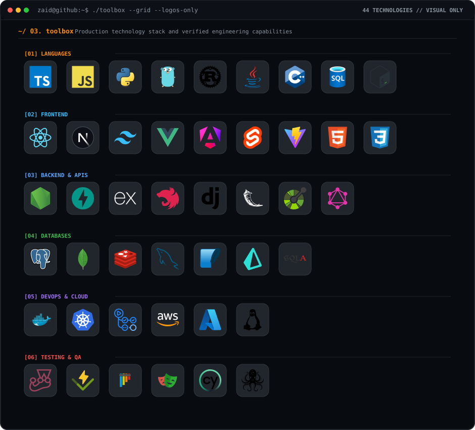
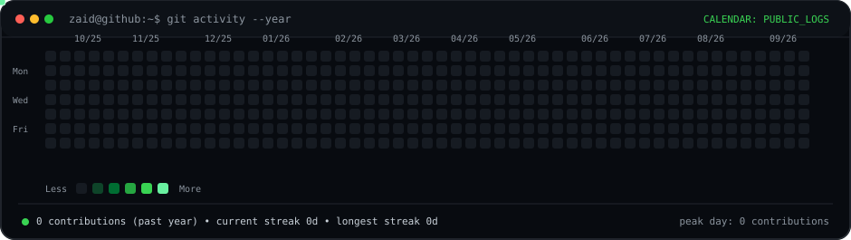

<div align="center">

```text
zaid@github:~$ whoami
```

# **`Z A I D`**
#### **Full Stack Developer · Software Engineer · Builder**

<p>
  <code>[ FRONTEND ]</code> &nbsp;
  <code>[ BACKEND ]</code> &nbsp;
  <code>[ DATABASES ]</code> &nbsp;
  <code>[ CLOUD ]</code> &nbsp;
  <code>[ AUTOMATION ]</code>
</p>

<p>
  <a href="https://github.com/Zaid7829"><strong>GitHub</strong></a> &nbsp;·&nbsp;
  <a href="mailto:mdyusuffaiz517@gmail.com"><strong>Email</strong></a> &nbsp;·&nbsp;
  <a href="https://github.com/Zaid7829?tab=repositories"><strong>Repositories</strong></a>
</p>

<!-- DIGITAL PARTICLE AVATAR -->


</div>

<br>

---

### `~/ 01. whoami`

<div align="center">
  
</div>

<br>

> *"Don't just make it work. Make it understandable, maintainable, and useful."*

<br>

---

### `~/ 03. toolbox`

<div align="center">
  
</div>

<br>

<!-- STRUCTURED TECHNICAL INDEX -->
<table>
  <tr>
    <td width="22%"><code>LANGUAGES</code></td>
    <td><strong>TypeScript</strong> · <strong>JavaScript</strong> · <strong>Python</strong> · <strong>Go</strong> · <strong>Rust</strong> · <strong>Java</strong> · <strong>C++</strong> · <strong>SQL</strong> · <strong>Bash</strong></td>
  </tr>
  <tr>
    <td width="22%"><code>FRONTEND</code></td>
    <td><strong>React</strong> · <strong>Next.js</strong> · <strong>Tailwind CSS</strong> · <strong>Vue</strong> · <strong>Angular</strong> · <strong>Svelte</strong> · <strong>Vite</strong> · <strong>HTML5/CSS3</strong></td>
  </tr>
  <tr>
    <td width="22%"><code>BACKEND &amp; APIS</code></td>
    <td><strong>Node.js</strong> · <strong>FastAPI</strong> · <strong>Express</strong> · <strong>NestJS</strong> · <strong>Django</strong> · <strong>Flask</strong> · <strong>REST</strong> · <strong>GraphQL</strong></td>
  </tr>
  <tr>
    <td width="22%"><code>DATABASES</code></td>
    <td><strong>PostgreSQL</strong> · <strong>MongoDB</strong> · <strong>Redis</strong> · <strong>MySQL</strong> · <strong>SQLite</strong> · <strong>Prisma ORM</strong> · <strong>SQLAlchemy</strong></td>
  </tr>
  <tr>
    <td width="22%"><code>DEVOPS &amp; CLOUD</code></td>
    <td><strong>Docker</strong> · <strong>Kubernetes</strong> · <strong>GitHub Actions</strong> · <strong>AWS</strong> · <strong>Azure</strong> · <strong>Linux</strong></td>
  </tr>
  <tr>
    <td width="22%"><code>TESTING &amp; QA</code></td>
    <td><strong>Jest</strong> · <strong>Vitest</strong> · <strong>Pytest</strong> · <strong>Playwright</strong> · <strong>Cypress</strong> · <strong>Testing Library</strong></td>
  </tr>
</table>

<br>

---

### `~/ 04. skill-radar`

<div align="center">
  
</div>

<br>

---

### `~/ 10. github-activity`

<div align="center">

<a href="https://github.com/Zaid7829">
  
</a>

</div>

<br>

---

### `~/ 12. contact`

```text
zaid@github:~$ ./connect
```

<div align="center">

<table width="100%">
  <tr>
    <td width="33.3%" align="center" valign="middle">
      <code>GITHUB</code><br>
      <strong>@Zaid7829</strong><br><br>
      <a href="https://github.com/Zaid7829"><strong>github.com/Zaid7829 →</strong></a>
    </td>
    <td width="33.3%" align="center" valign="middle">
      <code>EMAIL</code><br>
      <strong>mdyusuffaiz517@gmail.com</strong><br><br>
      <a href="mailto:mdyusuffaiz517@gmail.com"><strong>Send Message →</strong></a>
    </td>
    <td width="33.3%" align="center" valign="middle">
      <code>REPOSITORY</code><br>
      <strong>Zaid7829/Zaid7829</strong><br><br>
      <a href="https://github.com/Zaid7829/Zaid7829"><strong>View Profile Source →</strong></a>
    </td>
  </tr>
</table>

<br>

#### **READY TO BUILD SOMETHING USEFUL?**

<p>
  <a href="mailto:mdyusuffaiz517@gmail.com"><strong>[ LET'S TALK → ]</strong></a> &nbsp;|&nbsp;
  <a href="https://github.com/Zaid7829"><strong>[ EXPLORE REPOSITORIES → ]</strong></a>
</p>

</div>

<br>

---

<div align="center">

```text
zaid@github:~$ exit

[PROCESS COMPLETED]
```

**`© Zaid · Developer Operating System · 2026`**

</div>
