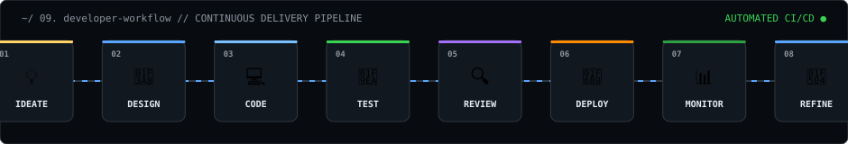

<div align="center">

```text
zaid@github:~$ whoami
```

# **`Z A I D`**
### **Full Stack Developer · Software Engineer · Builder**

<!-- STATUS PILLS -->
[](#)
[](#)
[](#)
[](#)

<br>

<!-- ACTION BUTTONS -->
<p align="center">
  <a href="https://github.com/Zaid7829">
    
  </a>
  &nbsp;
  <a href="mailto:mdyusuffaiz517@gmail.com">
    
  </a>
  &nbsp;
  <a href="#-08-selected-work">
    
  </a>
</p>

<br>

<!-- HERO CONSTELLATION -->


<br><br>

<!-- PORTRAIT + SPECS DUAL CONTAINER -->
<table>
  <tr>
    <td width="50%" align="center" valign="top">
      
    </td>
    <td width="50%" align="center" valign="top">
      
    </td>
  </tr>
</table>

</div>

<br>

---

## `~/ 01. whoami`

<table>
  <tr>
    <td width="50%" align="center" valign="middle">

```text
┌─────────────────────────────┐
│            ZAID             │
│                             │
│   ◉ FULL STACK              │
│   ◉ SOFTWARE ENGINEER       │
│   ◉ BUILDER                 │
│                             │
│   CODE → TEST → AUTOMATE    │
│          → SHIP             │
└─────────────────────────────┘
```

</td>
<td width="50%" valign="middle">

<div align="center">

[](#)
<br>
[](#)
<br>
[](#)
<br>
[](#)
<br>
[](#)
<br>
[](#)

</div>

</td>
</tr>
</table>

> 💬 *"Don't just make it work. Make it understandable, maintainable, and useful."*

<br>

---

## `~/ 02. what-i-build`

<table>
  <tr>
    <td width="25%" align="center" valign="top">
      <h3>🌐</h3>
      <b>FULL STACK</b><br><br>
      <br>
      <br>
      <br>
      
    </td>
    <td width="25%" align="center" valign="top">
      <h3>⚛️</h3>
      <b>FRONTEND</b><br><br>
      <br>
      <br>
      <br>
      
    </td>
    <td width="25%" align="center" valign="top">
      <h3>⚙️</h3>
      <b>BACKEND</b><br><br>
      <br>
      <br>
      <br>
      
    </td>
    <td width="25%" align="center" valign="top">
      <h3>🗄️</h3>
      <b>DATABASES</b><br><br>
      <br>
      <br>
      <br>
      
    </td>
  </tr>
  <tr>
    <td width="25%" align="center" valign="top">
      <h3>☁️</h3>
      <b>CLOUD & DEVOPS</b><br><br>
      <br>
      <br>
      <br>
      
    </td>
    <td width="25%" align="center" valign="top">
      <h3>🤖</h3>
      <b>AI / ML</b><br><br>
      <br>
      <br>
      <br>
      
    </td>
    <td width="25%" align="center" valign="top">
      <h3>🛠️</h3>
      <b>DEV TOOLS</b><br><br>
      <br>
      <br>
      <br>
      
    </td>
    <td width="25%" align="center" valign="top">
      <h3>🔐</h3>
      <b>SECURITY & AUTH</b><br><br>
      <br>
      <br>
      <br>
      
    </td>
  </tr>
</table>

<br>

---

## `~/ 03. toolbox`

<div align="center">
  
</div>

<br>

<!-- TECHNOLOGY WALL WITH HIERARCHY -->
<div align="center">

<p>
  <b>LANGUAGES</b><br>
  
  
  
  
  
  
  
  
</p>

<p>
  <b>FRONTEND</b><br>
  
  
  
  
  
  
  
</p>

<p>
  <b>BACKEND & APIS</b><br>
  
  
  
  
  
  
</p>

<p>
  <b>DATABASE & DEVOPS</b><br>
  
  
  
  
  
  
  
</p>

</div>

<br>

---

## `~/ 04. skill-radar`

<table>
  <tr>
    <td width="60%" align="center" valign="middle">
      
    </td>
    <td width="40%" valign="middle">

<div align="center">

[](#)
<br><br>
[](#)
<br><br>
[](#)

</div>

</td>
</tr>
</table>

<br>

---

## `~/ 05. system-architecture`

<div align="center">
  
</div>

<br>

---

## `~/ 07. engineering-principles`

<!-- 8 PRINCIPLES WALL AS VISUAL CARDS -->
<table>
  <tr>
    <td width="25%" align="center" title="Software exists to solve real problems for real people">
      <h3>👤</h3>
      <b>USER FIRST</b><br>
      
    </td>
    <td width="25%" align="center" title="Code is read ten times more often than it is written">
      <h3>📖</h3>
      <b>READABILITY</b><br>
      
    </td>
    <td width="25%" align="center" title="Zero-leak secret habits and defensive boundaries from day zero">
      <h3>🔐</h3>
      <b>SECURITY</b><br>
      
    </td>
    <td width="25%" align="center" title="Speed and low memory footprints improve user retention">
      <h3>⚡</h3>
      <b>PERFORMANCE</b><br>
      
    </td>
  </tr>
  <tr>
    <td width="25%" align="center" title="Semantic markup, keyboard navigation and screen-reader access">
      <h3>♿</h3>
      <b>ACCESSIBILITY</b><br>
      
    </td>
    <td width="25%" align="center" title="Test critical business logic, contracts and edge cases">
      <h3>🧪</h3>
      <b>TESTING</b><br>
      
    </td>
    <td width="25%" align="center" title="If a task must be executed twice, automate it in a script">
      <h3>🔧</h3>
      <b>AUTOMATION</b><br>
      
    </td>
    <td width="25%" align="center" title="Record why architectural decisions and tradeoffs were chosen">
      <h3>📝</h3>
      <b>DOCUMENTATION</b><br>
      
    </td>
  </tr>
</table>

<br>

---

## `~/ 08. selected-work`

<table>
  <tr>
    <td width="50%" valign="top">

```text
$ cd projects/system-profile-os
```


#### **Developer Operating System Engine**
`Zaid7829/Zaid7829`

<p>
  
  
  
</p>

<p>
  
  &nbsp;
  <a href="https://github.com/Zaid7829/Zaid7829">
    
  </a>
  &nbsp;
  <a href="https://github.com/Zaid7829">
    
  </a>
</p>

</td>
<td width="50%" valign="top">

```text
$ cd projects/fullstack-app-suite
```


#### **Full-Stack Application Staging Suite**
`Standardized Full-Stack Architecture Pipeline`

<p>
  
  
  
  
</p>

<p>
  
  &nbsp;
  <a href="./PROJECT_TEMPLATE.md">
    
  </a>
  &nbsp;
  <a href="https://github.com/Zaid7829">
    
  </a>
</p>

</td>
</tr>
</table>

<br>

---

## 🛡️ `PROJECT QUALITY GATE`

<div align="center">
  
</div>

<br>

---

## `~/ 09. developer-workflow`

<div align="center">
  
</div>

<br>

---

## `~/ 10. github-activity`

<div align="center">

<a href="https://github.com/Zaid7829">
  
</a>

<br><br>

<table>
  <tr>
    <td width="33%" align="center">
      <h3>📈</h3>
      <b>COMMIT RHYTHM</b><br>
      
    </td>
    <td width="34%" align="center">
      <h3>⚙️</h3>
      <b>TELEMETRY ENGINE</b><br>
      
    </td>
    <td width="33%" align="center">
      <h3>🐙</h3>
      <b>DATA SOURCE</b><br>
      
    </td>
  </tr>
</table>

</div>

<br>

---

## `~/ 11. open-source-mindset`

<table>
  <tr>
    <td width="20%" align="center" title="Consistent naming conventions, explicit schemas, and structured errors">
      <h3>🔌</h3>
      <b>Predictable APIs</b><br>
      
    </td>
    <td width="20%" align="center" title="Documented environment vars, deterministic locks, and clean containers">
      <h3>📦</h3>
      <b>Reproducible Envs</b><br>
      
    </td>
    <td width="20%" align="center" title="Granular, descriptive commit logs that communicate why">
      <h3>🧱</h3>
      <b>Atomic Commits</b><br>
      
    </td>
    <td width="20%" align="center" title="Validating network inputs and handling edge-case failures">
      <h3>🛡️</h3>
      <b>Defensive Habits</b><br>
      
    </td>
    <td width="20%" align="center" title="Writing readable, accessible code and docs so peers build with confidence">
      <h3>🤝</h3>
      <b>Collaborator Respect</b><br>
      
    </td>
  </tr>
</table>

<br>

---

## `~/ 12. contact`

```text
zaid@github:~$ ./connect
```

<div align="center">

<table width="100%">
  <tr>
    <td width="33.3%" align="center" valign="middle">
      <br>
      <br><br>
      <h3>◉</h3>
      <b>@Zaid7829</b><br><br>
      <a href="https://github.com/Zaid7829">
        
      </a>
      <br><br>
    </td>
    <td width="33.3%" align="center" valign="middle">
      <br>
      <br><br>
      <h3>✉️</h3>
      <b>Direct Mail</b><br><br>
      <a href="mailto:mdyusuffaiz517@gmail.com">
        
      </a>
      <br><br>
    </td>
    <td width="33.3%" align="center" valign="middle">
      <br>
      <br><br>
      <h3>◈</h3>
      <b>Source Code</b><br><br>
      <a href="https://github.com/Zaid7829/Zaid7829">
        
      </a>
      <br><br>
    </td>
  </tr>
</table>

<br>

<a href="mailto:mdyusuffaiz517@gmail.com">
  
</a>

</div>

<br>

---

<div align="center">

```text
zaid@github:~$ exit

[PROCESS COMPLETED]
```

**`© Zaid · Developer Operating System · 2026`**

</div>
