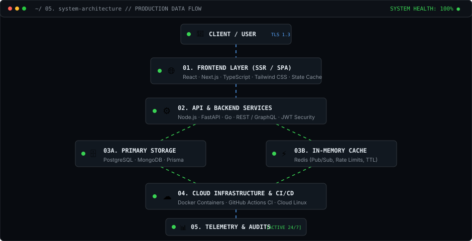
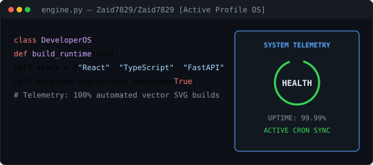
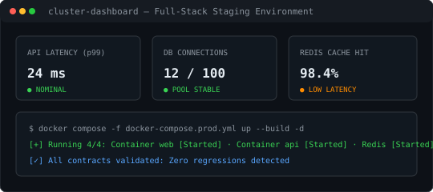
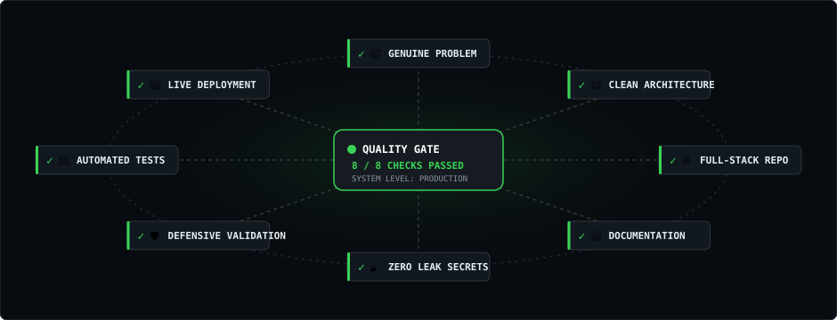

<div align="center">

```text
zaid@github:~$ whoami
```

# **`Z A I D`**
#### **Full Stack Developer · Software Engineer · Builder**

<p>
  <code>[ FRONTEND ]</code> &nbsp;
  <code>[ BACKEND ]</code> &nbsp;
  <code>[ DATABASES ]</code> &nbsp;
  <code>[ CLOUD ]</code> &nbsp;
  <code>[ AUTOMATION ]</code>
</p>

<p>
  <a href="https://github.com/Zaid7829"><strong>GitHub</strong></a> &nbsp;·&nbsp;
  <a href="mailto:mdyusuffaiz517@gmail.com"><strong>Email</strong></a> &nbsp;·&nbsp;
  <a href="#-08-selected-work"><strong>Selected Work</strong></a>
</p>

<br>

<!-- EDITORIAL DUAL DISPLAY: PORTRAIT & SYSTEM SPEC -->
<table>
  <tr>
    <td width="50%" align="center" valign="top">
      
    </td>
    <td width="50%" align="center" valign="top">
      
    </td>
  </tr>
</table>

</div>

<br>

---

### `~/ 01. whoami`

<table>
  <tr>
    <td width="42%" valign="top">

```text
IDENTITY      Zaid
ROLE          Full Stack Developer
LOCATION      Global / Remote
CORE ENGINE   Architecture → Code
              → Test → Ship
STATUS        Active // Building
```

</td>
<td width="58%" valign="top">

```text
[01] FRONTEND     Reactive, accessible, component-driven UI systems
[02] BACKEND      High-throughput REST & GraphQL application services
[03] DATABASES    Relational schemas, ACID transactions & Redis cache
[04] CLOUD        Containerized Docker deployments & automated CI/CD
[05] SECURITY     Defensive validation, zero-leak secrets & JWT auth
[06] AUTOMATION   Task scripts, git hooks & developer tooling
```

</td>
</tr>
</table>

> *"Don't just make it work. Make it understandable, maintainable, and useful."*

<br>

---

### `~/ 02. what-i-build`

#### `FEATURED ARCHITECTURAL LAYER`

<table>
  <tr>
    <td width="100%" valign="top">

#### **01. Full-Stack Systems Architecture**
*End-to-end applications designed with strict system boundaries, typed contracts, and zero-downtime deployment.*

`Core Stack:` **React** · **Next.js** · **TypeScript** · **FastAPI** · **Node.js** · **PostgreSQL** · **Redis** · **Docker**

</td>
</tr>
</table>

#### `APPLICATION & DATA LAYERS`

<table>
  <tr>
    <td width="50%" valign="top">

#### **02. Frontend Engineering**
*Accessible, performance-critical web applications with component systems and server-side rendering.*

- **Technologies:** React, Next.js, Tailwind CSS, Vue, Vite
- **Focus:** Micro-interactions, Web Vitals, Responsive Design

</td>
<td width="50%" valign="top">

#### **03. Backend & Distributed APIs**
*Robust application servers, schema routing, background workers, and low-latency API contracts.*

- **Technologies:** Node.js, FastAPI, Go, Express, GraphQL
- **Focus:** Auth boundaries, rate-limiting, error handling

</td>
</tr>
  <tr>
    <td width="50%" valign="top">

#### **04. Database & Cache Modeling**
*Relational database normalization, indexing strategies, and multi-tier in-memory caching.*

- **Technologies:** PostgreSQL, MongoDB, Redis, Prisma
- **Focus:** Query optimization, sub-millisecond key lookups

</td>
<td width="50%" valign="top">

#### **05. Cloud Infrastructure & CI/CD**
*Reproducible container environments, continuous deployment, and telemetry infrastructure.*

- **Technologies:** Docker, GitHub Actions, AWS, Linux CLI
- **Focus:** Automated validation, environment isolation

</td>
</tr>
</table>

#### `SPECIALIZED CAPABILITIES`

<table>
  <tr>
    <td width="33.3%" valign="top">

**06. AI / ML Integration**  
*Vector embeddings &amp; LLM tooling.*  
`OpenAI` · `LangChain` · `PyTorch`

</td>
<td width="33.3%" valign="top">

**07. Developer Tooling**  
*CLI automation &amp; git workflows.*  
`Bash` · `Python` · `Make` · `Git`

</td>
<td width="33.3%" valign="top">

**08. Security &amp; Auth**  
*Defensive validation &amp; zero secrets.*  
`OAuth 2.0` · `JWT` · `TLS 1.3`

</td>
</tr>
</table>

<br>

---

### `~/ 03. toolbox`

<div align="center">
  
</div>

<br>

<!-- STRUCTURED TECHNICAL INDEX -->
<table>
  <tr>
    <td width="22%"><code>LANGUAGES</code></td>
    <td><strong>TypeScript</strong> · <strong>JavaScript</strong> · <strong>Python</strong> · <strong>Go</strong> · <strong>Rust</strong> · <strong>Java</strong> · <strong>C++</strong> · <strong>SQL</strong> · <strong>Bash</strong></td>
  </tr>
  <tr>
    <td width="22%"><code>FRONTEND</code></td>
    <td><strong>React</strong> · <strong>Next.js</strong> · <strong>Tailwind CSS</strong> · <strong>Vue</strong> · <strong>Angular</strong> · <strong>Svelte</strong> · <strong>Vite</strong> · <strong>HTML5/CSS3</strong></td>
  </tr>
  <tr>
    <td width="22%"><code>BACKEND &amp; APIS</code></td>
    <td><strong>Node.js</strong> · <strong>FastAPI</strong> · <strong>Express</strong> · <strong>NestJS</strong> · <strong>Django</strong> · <strong>Flask</strong> · <strong>REST</strong> · <strong>GraphQL</strong></td>
  </tr>
  <tr>
    <td width="22%"><code>DATABASES</code></td>
    <td><strong>PostgreSQL</strong> · <strong>MongoDB</strong> · <strong>Redis</strong> · <strong>MySQL</strong> · <strong>SQLite</strong> · <strong>Prisma ORM</strong> · <strong>SQLAlchemy</strong></td>
  </tr>
  <tr>
    <td width="22%"><code>DEVOPS &amp; CLOUD</code></td>
    <td><strong>Docker</strong> · <strong>Kubernetes</strong> · <strong>GitHub Actions</strong> · <strong>AWS</strong> · <strong>Azure</strong> · <strong>Linux</strong></td>
  </tr>
  <tr>
    <td width="22%"><code>TESTING &amp; QA</code></td>
    <td><strong>Jest</strong> · <strong>Vitest</strong> · <strong>Pytest</strong> · <strong>Playwright</strong> · <strong>Cypress</strong> · <strong>Testing Library</strong></td>
  </tr>
</table>

<br>

---

### `~/ 04. skill-radar`

<div align="center">
  
</div>

<br>

---

### `~/ 05. system-architecture`

<div align="center">
  
</div>

<br>

---

### `~/ 07. engineering-principles`

<!-- 2-COLUMN COMPACT INDEX MATRIX -->
<table>
  <tr>
    <td width="50%" valign="top">

`01. User First`  
Software exists to solve genuine problems for real humans, not to exhibit gratuitous technical complexity.

---

`02. Simplicity Wins`  
Choose clear, straightforward implementations over clever, opaque abstractions every single time.

---

`03. Readability Matters`  
Code is read ten times more often than it is written. Design self-documenting code with clear semantics.

---

`04. Security by Default`  
Incorporate zero-leak secret habits, strict boundary sanitization, and least-privilege auth from day zero.

---

`05. Performance is a Feature`  
Speed is a foundational feature. Minimize network roundtrips, optimize query execution, and prevent leaks.

---

`06. Accessibility Counts`  
Semantic markup, keyboard navigability, high contrast, and screen-reader access are core quality requirements.

</td>
<td width="50%" valign="top">

`07. Automate the Routine`  
If a task, validation, or build must be executed more than twice, encode it into a deterministic script.

---

`08. Test Behavior`  
Test critical business logic, contracts, edge cases, and user journeys rather than trivial implementation details.

---

`09. Document Decisions`  
Record *why* architectural choices and tradeoffs were made, not simply *what* files were modified.

---

`10. Small Iterations`  
Deploy small, testable, incremental improvements continuously rather than stalling for delayed monoliths.

---

`11. Learn from Bugs`  
Root cause every defect. Fix the underlying design assumption and add regression guards to prevent repeat issues.

---

`12. Useful Software`  
Functional software delivered reliably into users' hands always beats unreleased theoretical perfection.

</td>
</tr>
</table>

<br>

---

### `~/ 08. selected-work`

<!-- PROJECT 01: VISUAL LEFT, SPEC RIGHT -->

```text
zaid@github:~$ cd projects/system-profile-os
```

<table>
  <tr>
    <td width="55%" valign="top" align="center">
      
    </td>
    <td width="45%" valign="top">

#### **Developer Operating System Engine**
`Zaid7829/Zaid7829`

- **Problem:** Developer profiles frequently rely on fragile third-party dynamic badge APIs that break or slow down page loads.
- **Architecture:** `GitHub Actions Engine` → `Deterministic Python Renderers` → `Native SVG Vector Output`
- **Stack:** Python 3.11 · SVG/XML · GitHub Actions CI · Bash
- **Status:** `● Production Live`

<br>

[**View Source Code →**](https://github.com/Zaid7829/Zaid7829) &nbsp;|&nbsp; [**Live README Profile →**](https://github.com/Zaid7829)

</td>
</tr>
</table>

<br>

<!-- PROJECT 02: SPEC LEFT, VISUAL RIGHT -->

```text
zaid@github:~$ cd projects/fullstack-app-suite
```

<table>
  <tr>
    <td width="45%" valign="top">

#### **Full-Stack Application Staging Suite**
`Standardized Application Pipeline`

- **Problem:** Transitioning from prototype to production requires reproducible environments and strict contract validation.
- **Architecture:** `Next.js SSR Frontend` → `FastAPI & Node.js API Gateway` → `PostgreSQL & Redis Cache`
- **Stack:** TypeScript · Next.js · FastAPI · PostgreSQL · Docker
- **Status:** `● Staging Ready`

<br>

[**View Architecture Spec →**](./PROJECT_TEMPLATE.md) &nbsp;|&nbsp; [**All Repositories →**](https://github.com/Zaid7829)

</td>
<td width="55%" valign="top" align="center">
      
    </td>
</tr>
</table>

<br>

---

### 🛡️ `PROJECT QUALITY GATE`

<div align="center">
  
</div>

<br>

---

### `~/ 10. github-activity`

<div align="center">

<a href="https://github.com/Zaid7829">
  
</a>

</div>

<br>

---

### `~/ 12. contact`

```text
zaid@github:~$ ./connect
```

<div align="center">

<table width="100%">
  <tr>
    <td width="33.3%" align="center" valign="middle">
      <code>GITHUB</code><br>
      <strong>@Zaid7829</strong><br><br>
      <a href="https://github.com/Zaid7829"><strong>github.com/Zaid7829 →</strong></a>
    </td>
    <td width="33.3%" align="center" valign="middle">
      <code>EMAIL</code><br>
      <strong>mdyusuffaiz517@gmail.com</strong><br><br>
      <a href="mailto:mdyusuffaiz517@gmail.com"><strong>Send Message →</strong></a>
    </td>
    <td width="33.3%" align="center" valign="middle">
      <code>REPOSITORY</code><br>
      <strong>Zaid7829/Zaid7829</strong><br><br>
      <a href="https://github.com/Zaid7829/Zaid7829"><strong>View Profile Source →</strong></a>
    </td>
  </tr>
</table>

<br>

#### **READY TO BUILD SOMETHING USEFUL?**

<p>
  <a href="mailto:mdyusuffaiz517@gmail.com"><strong>[ LET'S TALK → ]</strong></a> &nbsp;|&nbsp;
  <a href="https://github.com/Zaid7829"><strong>[ EXPLORE REPOSITORIES → ]</strong></a>
</p>

</div>

<br>

---

<div align="center">

```text
zaid@github:~$ exit

[PROCESS COMPLETED]
```

**`© Zaid · Developer Operating System · 2026`**

</div>
