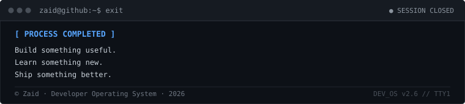

<div align="center">

<!-- PROFILE IMAGE FIRST -->

<br>

<br>

### **Full Stack Developer &nbsp;·&nbsp; Software Engineer &nbsp;·&nbsp; Builder**

<p>
  <a href="#-03-toolbox" title="Frontend Engineering">&nbsp;<sub><strong>Frontend</strong></sub></a>
  &nbsp;&nbsp;&nbsp;·&nbsp;&nbsp;&nbsp;
  <a href="#-03-toolbox" title="Backend &amp; Distributed APIs">&nbsp;<sub><strong>Backend</strong></sub></a>
  &nbsp;&nbsp;&nbsp;·&nbsp;&nbsp;&nbsp;
  <a href="#-03-toolbox" title="Databases &amp; Cache Modeling">&nbsp;<sub><strong>Databases</strong></sub></a>
  &nbsp;&nbsp;&nbsp;·&nbsp;&nbsp;&nbsp;
  <a href="#-03-toolbox" title="Cloud Infrastructure &amp; DevOps">&nbsp;<sub><strong>Cloud</strong></sub></a>
  &nbsp;&nbsp;&nbsp;·&nbsp;&nbsp;&nbsp;
  <a href="#-03-toolbox" title="Automation &amp; CI/CD">&nbsp;<sub><strong>Automation</strong></sub></a>
</p>

<p>
  <a href="https://github.com/Zaid7829">&nbsp;<strong>GitHub</strong></a>
  &nbsp;&nbsp;&nbsp;·&nbsp;&nbsp;&nbsp;
  <a href="mailto:mdyusuffaiz517@gmail.com">&nbsp;<strong>Email</strong></a>
  &nbsp;&nbsp;&nbsp;·&nbsp;&nbsp;&nbsp;
  <a href="https://github.com/Zaid7829?tab=repositories">&nbsp;<strong>Repositories</strong></a>
</p>

</div>

<br>

---

### `~/ 01. whoami`

<div align="center">
  
  <p>
    <sub><kbd>CURRENT BUILDS</kbd>&nbsp;&nbsp;
      <a href="https://github.com/Zaid7829/Aura"><strong>◉ Aura</strong></a>
      &nbsp;&nbsp;·&nbsp;&nbsp;
      <a href="https://github.com/Zaid7829/AgentFlow"><strong>◉ AgentFlow</strong></a>
    </sub>
  </p>
</div>

<br>

> *"Don't just make it work. Make it understandable, maintainable, and useful."*

<br>

---

### `~/ 03. toolbox`

<div align="center">
  
</div>

<br>

---

### `~/ 04. skill-radar`

<div align="center">
  
</div>

<br>

---

### `~/ 10. github-activity`

<div align="center">

<a href="https://github.com/Zaid7829">
  
</a>

</div>

<br>

---

### `~/ 12. contact`

```text
zaid@github:~$ ./connect
```

<div align="center">

<table width="760">
  <tbody>
    <tr>
      <td width="44" align="center" valign="middle">
        <a href="https://github.com/Zaid7829" title="GitHub: @Zaid7829"></a>
      </td>
      <td width="130" valign="middle">
        <a href="https://github.com/Zaid7829"><strong>GitHub</strong></a>
      </td>
      <td valign="middle">
        <a href="https://github.com/Zaid7829"><code>@Zaid7829</code></a>
      </td>
      <td width="40" align="right" valign="middle">
        <a href="https://github.com/Zaid7829"><strong>→</strong></a>
      </td>
    </tr>
    <tr>
      <td width="44" align="center" valign="middle">
        <a href="mailto:mdyusuffaiz517@gmail.com" title="Email: mdyusuffaiz517@gmail.com"></a>
      </td>
      <td width="130" valign="middle">
        <a href="mailto:mdyusuffaiz517@gmail.com"><strong>Email</strong></a>
      </td>
      <td valign="middle">
        <a href="mailto:mdyusuffaiz517@gmail.com"><code>mdyusuffaiz517@gmail.com</code></a>
      </td>
      <td width="40" align="right" valign="middle">
        <a href="mailto:mdyusuffaiz517@gmail.com"><strong>→</strong></a>
      </td>
    </tr>
    <tr>
      <td width="44" align="center" valign="middle">
        <a href="https://github.com/Zaid7829/Zaid7829" title="Repository: Zaid7829/Zaid7829"></a>
      </td>
      <td width="130" valign="middle">
        <a href="https://github.com/Zaid7829/Zaid7829"><strong>Repository</strong></a>
      </td>
      <td valign="middle">
        <a href="https://github.com/Zaid7829/Zaid7829"><code>Zaid7829/Zaid7829</code></a>
      </td>
      <td width="40" align="right" valign="middle">
        <a href="https://github.com/Zaid7829/Zaid7829"><strong>→</strong></a>
      </td>
    </tr>
  </tbody>
</table>

<br>

#### **READY TO BUILD SOMETHING USEFUL?**

<br>

<table width="420" align="center">
  <tbody>
    <tr>
      <td align="center" valign="middle">
        <br>
        <code>$ ./start-a-conversation</code>
        <br><br>
        <a href="mailto:mdyusuffaiz517@gmail.com"><strong><code>[ LET'S TALK → ]</code></strong></a>
        <br><br>
      </td>
    </tr>
  </tbody>
</table>

</div>

<br>

---

<div align="center">



</div>


